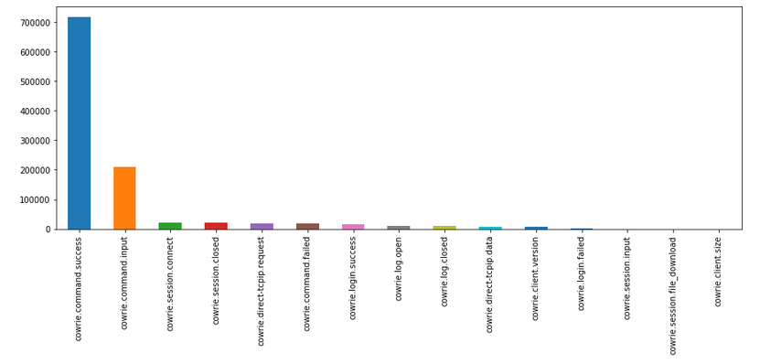
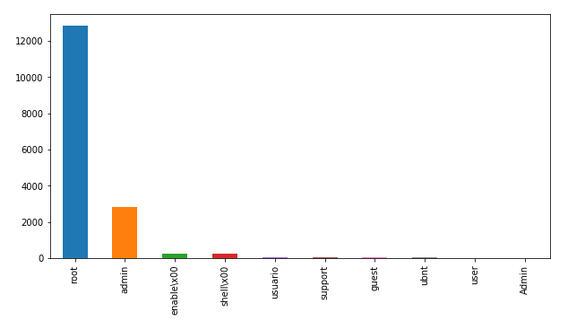
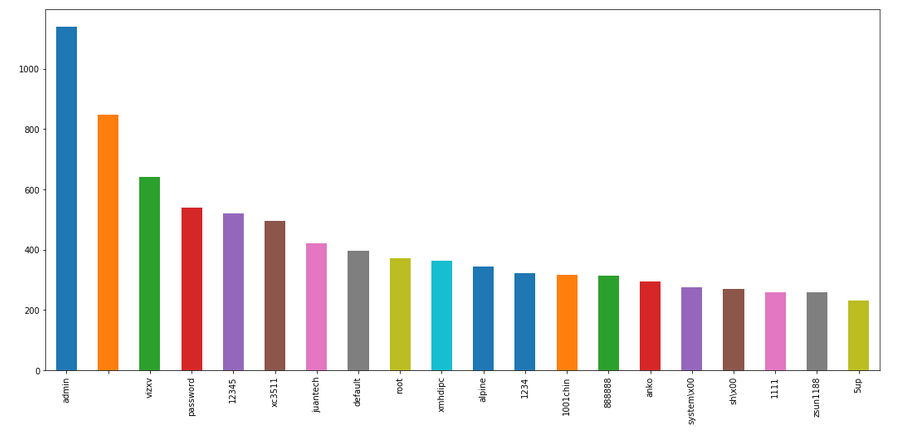
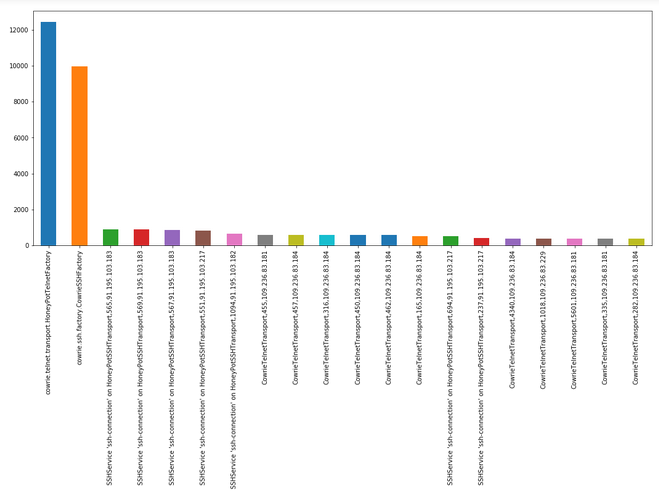

# HMM for Cowrie Honeypot

--- 
## File Description
```python
hmm_cowrie.ipynb: hmm on cowrie dataset
mc_cowrie.ipynb: markov chain on cowrie dataset
helper_functions.py: support functions for visulation and probablities
hmm.py: hmm implementation
markovchain.py: markovchain implementation
data_visualization: cowrie data visualization
```

---
## Features implemented
<ul>
  <li>sequence probablity</li>
  <li>next state probablity</li>
  <li>highly probable next state</li>
  <li>least probable next state</li>
  <li>highly probable sequnce</li>
  <li>least probable sequence</li>
  <li>number of sequences per length</li>
  <li>abstracted functions</li>
  <li>variable length markovchain</li>
</ul>

### Features yet to be added:
<ul>
  <li>variable sequence length for hmm</li>
  <li>dashboard for displaying results</li>
</ul>

---
## Dataset Visualization

<p align="center">
                                                                                                                                  </p>
<p align="center">
                                                                                                                                  </p>
<p align="center">
                                                                                                                                  </p>
<p align="center">
                                                                                                                                  </p>
<p align="center">
                                                                                                                                  </p>
