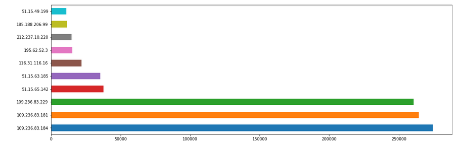

# HMM for Cowrie Honeypot

### File Description
hmm_cowrie.ipynb: hmm on cowrie dataset 
mc_cowrie.ipynb: markov chain on cowrie dataset 
helper_functions.py: support functions for visulation and probablities 
hmm.py: hmm implementation 
markovchain.py: markovchain implementation 
data_visualization: cowrie data visualization 

 
### Features implemented
<ul>
  <li>sequence probablity</li>
  <li>next state probablity</li>
  <li>highly probable next state</li>
  <li>least probable next state</li>
  <li>highly probable sequnce</li>
  <li>least probable sequence</li>
  <li>number of sequences per length</li>
  <li>abstracted functions</li>
  <li>variable length markovchain</li>
</ul>

#### Features yet to be added:
<ul>
  <li>variable sequence length for hmm</li>
  <li>dashboard for displaying results</li>
</ul>

 
### Dataset Visualization

                                                                                                                                  

                                                                                                                                  

                                                                                                                                  

                                                                                                                                  

                                                                                                                                  

